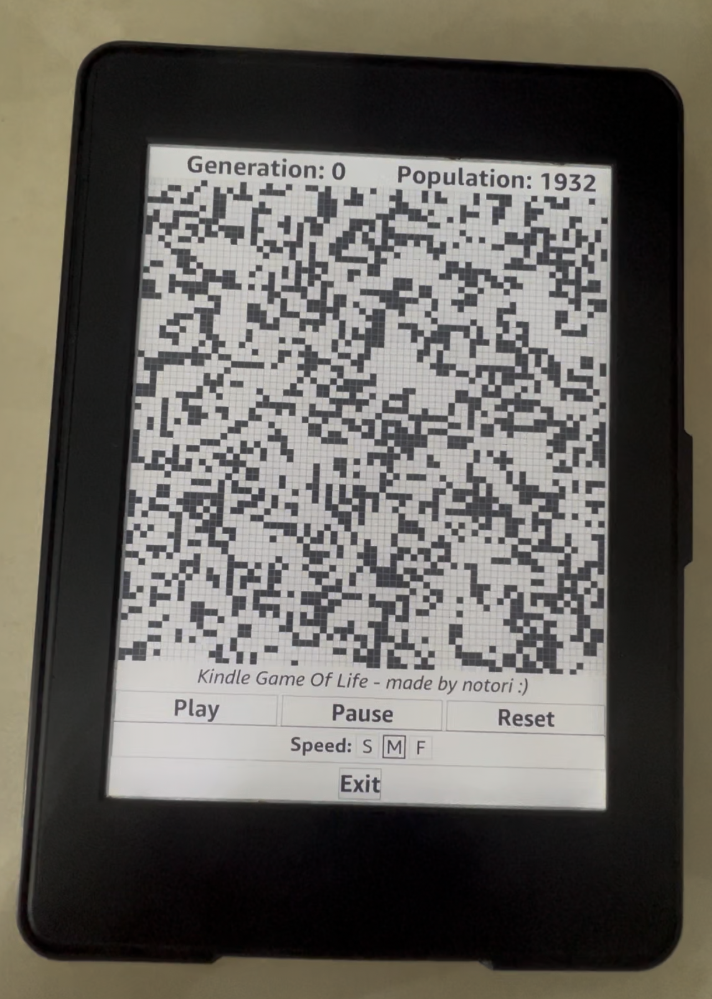
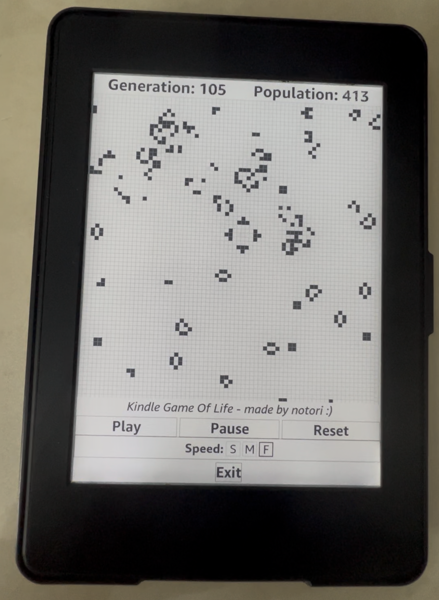

# Kindle Game Of Life
Java Applet turned Swing application into a Booklet to run on Kindle (FW <= 5.16.2.1.1)
- Tested on:
  -  _Kindle Paperwhite 3 (7th Generation)_

<https://github.com/n0tori/kindle-game-of-life/blob/main/examples/demo.mp4>

# Requirements
1. Kindle is jailbroken - see [this](https://kindlemodding.org/jailbreaking/kindle-models) for your jalibreak
2. [MRPI](https://kindlemodding.org/jailbreaking/post-jailbreak/installing-kual-mrpi/) installed

# Install
1. Download the latest release of this repo.
2. Plug Kindle in PC.
3. Run ```install.sh```
4. On Kindle enter: ```;log mrpi``` in search bar.
5. GameOfLife booklet should appear in library after the Kindle restarts.

# Uninstall
1. Repeat Install instructions but run ```uninstall.sh```.

# Build
1. Clone repo
2. Install latest version of Maven.
3. Fetch some jars from your Kindle, either through [SSH](https://wiki.mobileread.com/wiki/USBNetwork) or this [tool](https://cowlark.com/kindle/jarextractor-0.1.zip)
4. Put them in a folder called _lib_ in the directory.
5. [Download](https://github.com/NiLuJe/KindleTool) and put _kindletool.exe_ in the root of the directory.
6. Run ```mvn install``` in the root of the directory.
7. Enjoy your update packages in the _target_ folder.

# Credit
All credit to this [project](https://github.com/ieb/Signalk_Booklet/tree/master) for their reverse engineering that is used to make this project happen.


